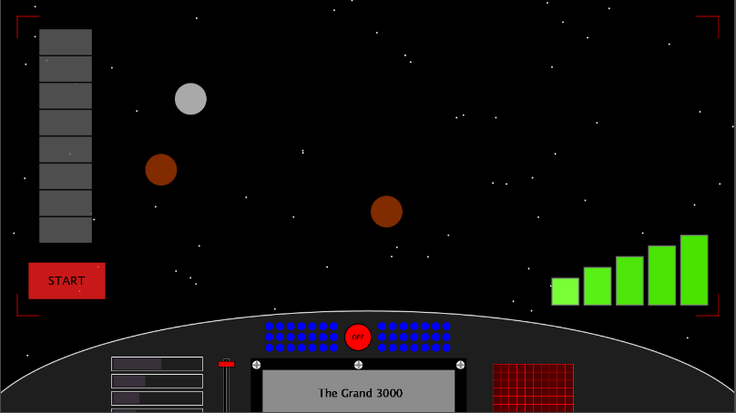
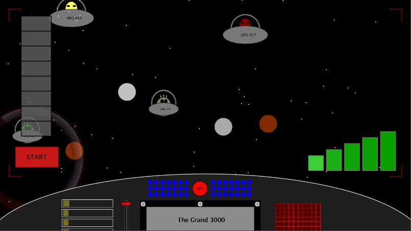
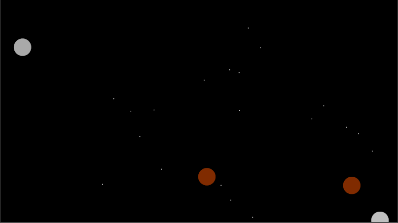

# SciFi UI Project

Name: Iman Rostam

Student Number: C17367011

Fork this repository and use it a starter project for your assignment

# Description of the assignment
For this OOP assignment I had to create a Sci-Fi User Interface. For my assignment I based it on the idea of spaceships, aliens and space in general. The UI allows the user to kill aliens and shoot down asteroids. Turn off the lights to experience and admire the stars and asteroids from inside The Grand 3000. 

# Instructions
<<<<<<< Updated upstream
Once the program runs, users will be greeted with the view of the blinking stars and moving asteroids as if they are inside the spaceship, *The Grand 3000*. Audio files, ComputerSound.mp3 and SpaceShip.mp3, will be playing in the background. 

The red, blue, purple and white spinning scope will follow the location of the mouseX. 

The bar chart on the right side will change colour base on the location of mouseX and mouseY. The bar chart on the control panel section will also move right to left according to the mouseX and mouseY. 

The scroll handle will move once you click on the red handle and move it up and down with your mouse. And if you click the red handle again it will stop at that location. 

Once the user is ready to kick some butt, the user can press on the 'START' button and 'the killing mode' will turn on which means the aliens will appear. To kill the aliens, users will use the scope to follow the aliens and once they click their mouse then the aliens will die and disappear. If the user wishes to be nice and not kill the aliens, they may exit 'the killing mode' by pressing key 'a'. 

While the user is on 'the killing mode', they can also destroy the asteroids by clicking on them. The asteroids will become smaller and smaller and eventually it will disappear. 

The user can enjoy and admire the stars and asteroids when the lights inside the spaceship is turned off by pressing the 'OFF' button. Audio files, Space.mp3 and Asteroids.mp3, will be played in the background for the user to relax.
=======
Once the program is run, users will be greeted with the view of the stars and asteroids. 
>>>>>>> Stashed changes

# How it works
These are the following classes made for this assignment:

#### Main Class 
The UI class is main class and where everything is called and rendered. This class includes array lists, the declaration of array lists, mouseClicked methods, mousePressed methods and keyPressed methods. 

#### Super Class
The UIElement class is the super class which all classes will need to inherit.

#### Control Panel
The control panels design was made up of different classes: 
- Control Panel class - This drew the control panel itself and the boxes
- CPBars class - This drew the bar left side of the control panel, this is the one that will move right to left following the mouseX
- CPButton class - This drew the small blue buttons and the red 'OFF' button. The 'OFF' button will bring you to another page, the LightsOff class
- Grid class - This drew the red grid
- UnknownObjects1 class and UnknownObjects2 class - This is the random ellipse shapes that appears on the grid
- Info class - Using a csv file to load the text 'The Grand 3000'
- ScrollBar class - This drew the scroll bar 
- ScrollHandle class - This drew the handle, the sliding of the handle was implemented in the main class, UI class

#### Scope Class
This class drew the circle scope that follows the mouseX and mouseY. I made the rotation of the arcs using pushMatrix(), translate(), rotate() and popMatrix() methods.

#### UFO Classes
I made 2 classes for UFO: UFO 1 and UFO 2. Both class carries the same functions the only different is that the alien and UFO itself in UFO1 class is bigger than the one in UFO2 class. The alien and UFO in UFO2 class also moves at a faster speed.


# What I am most proud of in the assignment


### Home page


### Killing Mode Page


### Lights Off Mode


# Markdown Tutorial

This is *emphasis*

This is a bulleted list

- Item
- Item

This is a numbered list

1. Item
1. Item

This is a [hyperlink](http://bryanduggan.org)

# Headings
## Headings
#### Headings
##### Headings

This is code:

```Java
public void render()
{
	ui.noFill();
	ui.stroke(255);
	ui.rect(x, y, width, height);
	ui.textAlign(PApplet.CENTER, PApplet.CENTER);
	ui.text(text, x + width * 0.5f, y + height * 0.5f);
}
```

So is this without specifying the language:

```
public void render()
{
	ui.noFill();
	ui.stroke(255);
	ui.rect(x, y, width, height);
	ui.textAlign(PApplet.CENTER, PApplet.CENTER);
	ui.text(text, x + width * 0.5f, y + height * 0.5f);
}
```

This is an image using a relative URL:


This is an image using an absolute URL:


This is a youtube video:

[](https://www.youtube.com/watch?v=J2kHSSFA4NU)

This is a table:

| Heading 1 | Heading 2 |
|-----------|-----------|
|Some stuff | Some more stuff in this column |
|Some stuff | Some more stuff in this column |
|Some stuff | Some more stuff in this column |
|Some stuff | Some more stuff in this column |

